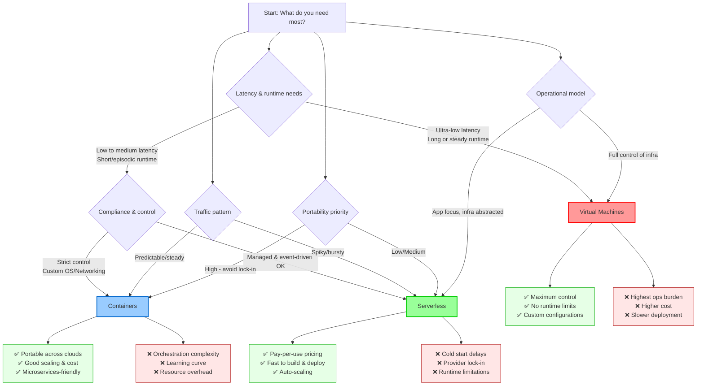

```mermaid
    flowchart TD
    A[Start: What do you need most?] --> B{Latency & runtime needs}
    B -->|Ultra-low latency<br/>Long or steady runtime| VMs[Virtual Machines]
    B -->|Low to medium latency<br/>Short/episodic runtime| C{Compliance & control}
    C -->|Strict control<br/>Custom OS/Networking| CON[Containers]
    C -->|Managed & event-driven OK| S[Serverless]
    A --> D{Traffic pattern}
    D -->|Spiky/bursty| S
    D -->|Predictable/steady| CON
    A --> E{Portability priority}
    E -->|High - avoid lock-in| CON
    E -->|Low/Medium| S
    A --> F{Operational model}
    F -->|Full control of infra| VMs
    F -->|App focus, infra abstracted| S
    
    %% Pros and Cons
    VMs --> P1[✅ Maximum control<br/>✅ No runtime limits<br/>✅ Custom configurations]
    VMs --> P2[❌ Highest ops burden<br/>❌ Higher cost<br/>❌ Slower deployment]
    CON --> P3[✅ Portable across clouds<br/>✅ Good scaling & cost<br/>✅ Microservices-friendly]
    CON --> P4[❌ Orchestration complexity<br/>❌ Learning curve<br/>❌ Resource overhead]
    S --> P5[✅ Pay-per-use pricing<br/>✅ Fast to build & deploy<br/>✅ Auto-scaling]
    S --> P6[❌ Cold start delays<br/>❌ Provider lock-in<br/>❌ Runtime limitations]

    %% Styling
    classDef vmStyle fill:#ff9999,stroke:#ff0000,stroke-width:2px
    classDef containerStyle fill:#99ccff,stroke:#0066cc,stroke-width:2px
    classDef serverlessStyle fill:#99ff99,stroke:#00cc00,stroke-width:2px
    classDef prosStyle fill:#e6ffe6,stroke:#00aa00,stroke-width:1px
    classDef consStyle fill:#ffe6e6,stroke:#aa0000,stroke-width:1px
    
    class VMs vmStyle
    class CON containerStyle
    class S serverlessStyle
    class P1,P3,P5 prosStyle
    class P2,P4,P6 consStyle
```
